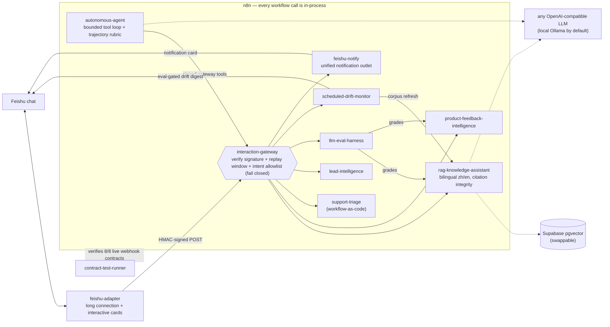

# n8n AI-PM Portfolio — Workflow-as-Code, Eval-First

[](https://github.com/najmahapih-jpg/n8n-ai-pm-portfolio/actions/workflows/ci.yml)

一套互联的 AI 产品工程作品集:用 n8n Workflow-as-Code 构建,评测先行,每个子系统都带离线验证门。
A connected AI product-engineering portfolio built as n8n Workflow-as-Code: eval-first, every
subsystem gated by offline, deterministic verification — **2,400+ assertions, all green in CI**.

**One repo, ten projects, full git history.** Each directory below was developed as an independent
repository with its own CI gates and per-file commit discipline, then assembled here with
`git subtree` (history preserved). Every project still works standalone — clone, `npm ci`, run its
offline gate, green with zero accounts, zero keys, zero GPUs.

## The system



Solid arrows are live, proven paths (each was exercised end-to-end against a real n8n instance
during development). Dashed arrows are swappable backends — the offline gates never touch them.

## Projects and their evidence

Every number below is printed by that project's offline gate — the same command CI runs. No live
backend, no API key, bit-reproducible.

| Directory | What it proves | Offline gate evidence |
|---|---|---|
| [`n8n-llm-eval-harness`](n8n-llm-eval-harness/) | Eval harness: deterministic assertions + LLM-as-judge that is never trusted as ground truth (judge calibration + drift guards) | 252 assertions (compiled workflow differential vs pure core) |
| [`n8n-rag-knowledge-assistant`](n8n-rag-knowledge-assistant/) | Bilingual zh/en RAG with citation integrity by construction, threshold-gated honest abstention, swappable corpus/models ([swap guide](n8n-rag-knowledge-assistant/docs/swap-corpus-and-models.md)) | 305 assertions (8 golden fixtures + abstain/fallback pins) |
| [`n8n-scheduled-drift-monitor`](n8n-scheduled-drift-monitor/) | Scheduled corpus refresh + eval-gated quality drift; digest integrity — a summary may not claim numbers the run record does not support | 346 assertions (incl. integrity negatives + safe-degrade) |
| [`n8n-interaction-gateway`](n8n-interaction-gateway/) | HMAC-signed, replay-windowed, intent-allowlisted gateway turning every workflow into an in-process callable target; fail-closed security core; its `notify` intent is the portfolio's unified notification outlet (one signed request → a Feishu card, callers hold no messaging credentials) | 28 security-core + 189 workflow assertions (17 scenarios) |
| [`n8n-autonomous-agent`](n8n-autonomous-agent/) | Bounded tool-use agent whose tools are the portfolio workflows via the signed gateway; one trajectory rubric scores both stub and live LLM planners | 69 core + 49 workflow + 20 gateway-client assertions |
| [`n8n-feishu-adapter`](n8n-feishu-adapter/) | Feishu long-connection chat entrance: signed allowlisted gateway client, interactive card replies with honest abstain/fallback | 34 assertions (parse / intent / sign / reply, no network) |
| [`n8n-product-feedback-intelligence`](n8n-product-feedback-intelligence/) | Feedback classification workflow (theme / sentiment / urgency), eval-harness SUT | 373 assertions (11 pin-data fixtures) |
| [`n8n-lead-intelligence-workflow`](n8n-lead-intelligence-workflow/) | Lead scoring + routing with PII redaction and audit events | 493 assertions (12 golden fixtures) |
| [`n8n-contract-test-runner`](n8n-contract-test-runner/) | Cross-repo machine-readable workflow-contract verification (the portfolio gate: 8/8 live webhook contracts) | 7-check self-test; catches every targeted defect class |
| [`n8n-workflow-as-code`](n8n-workflow-as-code/) | The Workflow-as-Code toolchain conventions + support-triage reference workflow + [cross-repo deployment guide](n8n-workflow-as-code/docs/adopt-on-your-n8n.md) | 292 assertions (9 pin-data fixtures) |

## Case studies (the decisions, not just the code)

**Honest abstention beats confident hallucination.** The RAG assistant derives citations from the
chunks it actually retrieved *before* any model generates text — swapping the LLM cannot change
attribution. Below the similarity floor it answers "信息不足,无法回答" / "Not enough information
to answer" instead of guessing, in the language the question was asked (deterministic zh/en
detection, no language model involved). Live retrieval uses real embeddings first and falls back
once to deterministic TF-IDF over the same corpus when the vector backend degrades — measured,
not assumed: the degrade path is pinned by offline tests.

**Security that fails closed, reviewed adversarially.** The gateway verifies an HMAC-SHA256
signature over the exact raw bytes, enforces a replay window, and allowlists intents; every
malformed input rejects. An independent review lane (never self-approve) caught a real
secret-reflection leak before release — the fix and its regression test are in the history. One
signed request can fan out to multiple workflows in-process and collect per-target results. The
gateway is also the portfolio's only notification outlet: a `notify` intent routes to a
Feishu-card sibling, so callers never hold messaging credentials — credential convergence by
construction (unconfigured webhook → an honest `skipped`, never a fabricated `sent`).

**One rubric for stub and live agents.** The autonomous agent's trajectory rubric (tool choice,
step economy, guardrail compliance, no fabricated results) grades the deterministic stub planner
in CI and the live `llama3.2:3b` planner identically. The eval produced an honest architecture
finding: free-form 3B step-planning scored 2/6 LOW trust, while LLM-classification +
deterministic routing scored 6/6 HIGH — so that is the shipped design. The rubric was never
loosened to make a result look better.

**Digests that cannot lie.** The drift monitor re-verifies every summary against its run records;
a digest claiming a pass-rate the records don't support fails the run. Quality drift is detected
by re-running the eval harness against the refreshed corpus — the gate is the eval, not a vibe.

## Reproduce

Each project is self-contained. Inside any project directory:

```powershell
npm ci          # where a package.json exists
npm run verify:static    # or verify:core / Test-Contract.ps1 -SelfTest, per the project README
```

All gates are offline and deterministic (stub-default; live backends are explicit opt-in per
request). See each project's README Quickstart and [the root CI workflow](.github/workflows/ci.yml)
for the exact command — CI runs the matrix on Linux, development happened on Windows, and the
generated artifacts are byte-identical on both.

## Trust invariants (the part that does not change when you swap content or models)

- Citations come from really-retrieved chunks, never from a model; fabricated attribution fails the run.
- Below the similarity floor the assistant says it does not have enough information — it never guesses.
- Summaries and digests are re-verified against run records; unsupported pass-rates fail the run.
- CI never touches a live backend; stub paths are bit-reproducible.

## Open-source hygiene

Safe-to-publish is verified here, not assumed:

- **No secrets are tracked — by gate, not by promise.** Only `.env.example` files exist in the
  tree; real values live in the local environment or n8n encrypted credentials. Every project
  ships a repository secret scan (`scripts/Test-RepositorySecrets.ps1`) that runs in its CI job,
  and tracked workflow JSON keeps credential fields empty or `__SCRUBBED__` (also gate-enforced).
- **The entire git history is audited, not just HEAD** (last audit 2026-06): every commit
  pattern-scanned for API keys, JWTs, cloud/VCS tokens, private keys, real webhook URLs,
  basic-auth URLs, bearer tokens, and hex secrets — zero real credentials. The only matches are
  deliberate synthetic test values (`gateway-test-secret`) and fictional fixture identities
  (`founder@gmail.com`, `*@example.test`).
- **Adversarial fixtures are synthetic by design.** Files like
  `fixtures/golden/06-secret-in-payload.json` contain fake secrets on purpose — they prove the
  gateway strips secret-bearing fields from the entire request envelope before any forwarding.
- **Each project carries its own `SECURITY.md`, `CONTRIBUTING.md`, and security-boundaries doc**,
  so the security contract survives cloning any directory standalone.

## License

Apache-2.0 — see [LICENSE](LICENSE). Each project directory also carries its own `LICENSE`
(Apache-2.0) so every project stays standalone-cloneable.
